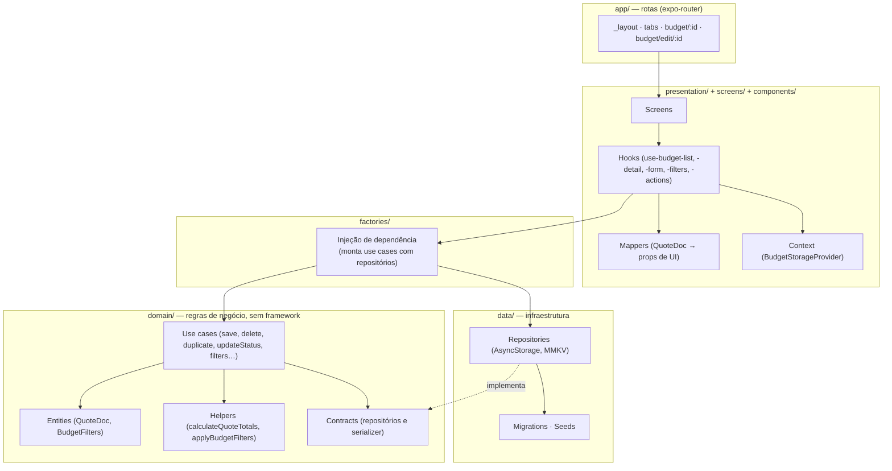

# Budget App

Aplicativo mobile para gestão de orçamentos de serviços. Permite criar um orçamento com título, cliente, status e lista de serviços, calcular subtotal/desconto/total localmente, filtrar e ordenar a listagem, duplicar, alterar status e remover — com tudo salvo no próprio dispositivo, sem back-end.

Projeto desenvolvido em React Native com Expo, com a interface baseada no layout do Figma do desafio.

---

## Funcionalidades

**Orçamentos**

- Criar orçamento com título, cliente, status e serviços inclusos
- Editar um orçamento existente (atualiza o mesmo registro e a data de atualização)
- Adicionar, editar e remover serviços, cada um com quantidade e preço próprios
- Duplicar um orçamento: a cópia recebe novo id, sufixo `(cópia)`, volta para rascunho e tem as datas reiniciadas
- Alterar o status a partir da listagem (toque longo no card) ou da tela de detalhe
- Remover com confirmação — tanto o orçamento quanto um serviço individual
- Compartilhar o resumo do orçamento pelo compartilhamento nativo do sistema

**Cálculo**

- Subtotal = soma de `preço × quantidade` de cada item
- Desconto percentual definido por orçamento (`discountPct`), editável no formulário e limitado a 0–100%
- Total = subtotal − desconto, nunca negativo

**Listagem**

- Busca por título ou cliente
- Filtro por status (rascunho, enviado, aprovado, recusado), combinável
- Ordenação por mais recente, mais antigo, maior valor e menor valor
- Indicador visual de filtro ativo e estado vazio distinto para "sem orçamentos" e "nenhum resultado"

**Persistência**

- Orçamentos salvos no dispositivo
- Filtros selecionados salvos no dispositivo e restaurados na abertura do app
- Migração automática de dados gravados por versões anteriores do app
- Dados de exemplo semeados na primeira execução

---

## Modelo de dados

O documento de orçamento é a única fonte de verdade persistida — os valores exibidos (total, moeda formatada, datas em pt-BR) são sempre derivados dele, nunca gravados em duplicidade.

```ts
type QuoteStatus = "draft" | "sent" | "approved" | "declined";

interface QuoteItem {
  id: string;
  description: string;   // nome do serviço (rótulo principal)
  qty: number;           // quantidade de vezes que o serviço foi realizado
  price: number;         // valor unitário, em número
  details?: string;      // descrição complementar exibida no layout
}

interface QuoteDoc {
  id: string;
  client: string;
  title: string;
  items: QuoteItem[];
  discountPct?: number;  // percentual de desconto, opcional
  status: QuoteStatus;
  createdAt: string;     // ISO 8601
  updatedAt: string;     // ISO 8601
}
```

Duas decisões importantes:

- **Preço é número, não string.** Formatação de moeda é responsabilidade da camada de apresentação. Isso evita reparse de `"R$ 3.847,50"` a cada cálculo.
- **Datas são ISO.** Permite ordenar por data de verdade, em vez de inferir ordem a partir do id.

---

## Tecnologias

| Área | Ferramenta |
| --- | --- |
| Runtime | [Expo](https://expo.dev) 54 · React Native 0.81 · React 19 |
| Linguagem | TypeScript 5.9 em modo `strict` |
| Navegação | [expo-router](https://docs.expo.dev/router/introduction/) 6 (file-based, com rotas tipadas) |
| Animação | [react-native-reanimated](https://docs.swmansion.com/react-native-reanimated/) 4 · react-native-gesture-handler |
| Persistência | [@react-native-async-storage/async-storage](https://react-native-async-storage.github.io/async-storage/) · [react-native-mmkv](https://github.com/mrousavy/react-native-mmkv) (quando disponível) |
| Ícones | @expo/vector-icons (Feather, MaterialIcons) |
| Área segura | react-native-safe-area-context |

Nova arquitetura do React Native (`newArchEnabled: true`) e rotas tipadas (`experiments.typedRoutes`) habilitadas em [app.json](app.json).

---

## Arquitetura

O projeto segue uma separação em camadas inspirada em Clean Architecture, com regra de dependência apontando sempre para dentro: **apresentação → domínio ← dados**. O domínio não conhece React, React Native nem AsyncStorage.



### Como as camadas se dividem

**`domain/`** — coração da aplicação, sem nenhum import de UI ou de biblioteca de storage.

- `entities/` — `QuoteDoc`, `QuoteItem`, `QuoteStatus`, `BudgetFilters` e a normalização de filtros lidos do disco
- `use-cases/` — uma classe por operação, com dependências recebidas via construtor: inicializar storage, listar, buscar por id, salvar (upsert), remover, duplicar, alterar status, ler/gravar filtros
- `helpers/` — regras puras: `calculateQuoteTotals` (subtotal, desconto, total) e `applyBudgetFilters` (status, busca, ordenação)
- `repositories/` e `adapters/` — contratos que a camada de dados implementa

**`data/`** — implementações concretas de infraestrutura.

- `infra/repositories/cache/` — `AsyncStorageRepository` e `MMKVStorageRepository`, ambos chave/valor com string
- `libs/` — encapsulamento das bibliotecas externas, para que o resto do código não importe o pacote direto
- `migrations/` — conversão do formato antigo (card + detalhe separados, preço em string, data em pt-BR) para `QuoteDoc`
- `seeds/` — orçamentos de exemplo da primeira execução

**`factories/`** — injeção de dependência manual. Monta os use cases com seus repositórios e escolhe o backend de storage em runtime: usa MMKV quando disponível e cai em AsyncStorage no Expo Go, atrás do mesmo contrato (`make-local-cache.factory.ts`).

**`presentation/`** — cola entre domínio e UI.

- `context/` — `BudgetStorageProvider` roda a inicialização/migração antes de liberar a árvore e expõe um contador de revisão que as telas observam para recarregar após qualquer escrita
- `hooks/budget/` — um hook por responsabilidade: `useBudgetList`, `useBudgetDetail`, `useBudgetForm`, `useBudgetFilters` e `useBudgetActions` (ações compartilhadas, incluindo a confirmação de remoção)
- `mappers/` — converte `QuoteDoc` nas props que os componentes esperam (moeda formatada, datas em pt-BR)

**`components/`** e **`screens/`** — apresentação pura. Componentes não conhecem use cases nem storage: recebem props e disparam callbacks. Cada um segue o padrão `index.tsx` + `interface.ts` + `styles.ts`, com `helpers/` quando há lógica de estilo condicional.

**`common/`** — utilitários transversais: chaves de storage centralizadas e helpers de formatação/parse de moeda, percentual e data (implementados sem `Intl`, para o resultado ser idêntico em qualquer engine JS).

### Fluxo de uma alteração

Salvar um orçamento percorre as camadas assim:

```
Budget (screen) → useBudgetForm → budgetUseCases.save (SaveBudgetUseCase)
  → LocalCacheUseCases.set → AsyncStorageRepository → AsyncStorage
  → notifyChange() → revision++ → useBudgetList / useBudgetDetail recarregam
```

---

## Estrutura de pastas

```
src/
├── app/                  # rotas file-based do expo-router
│   ├── (tabs)/           # dashboard + novo orçamento
│   └── budget/           # [id] (detalhe) e edit/[id] (edição)
├── common/               # constantes e helpers transversais
│   ├── constants/keys-storage/
│   └── helpers/          # format.ts, create-id.ts
├── components/           # componentes de UI (index + interface + styles)
├── data/                 # infraestrutura
│   ├── infra/repositories/cache/
│   ├── libs/             # AsyncStorage e MMKV encapsulados
│   ├── migrations/
│   └── seeds/
├── domain/               # regras de negócio
│   ├── adapters/
│   ├── entities/budget/
│   ├── helpers/
│   ├── repositories/
│   └── use-cases/
├── factories/            # injeção de dependência
├── presentation/         # context, hooks e mappers
├── screens/              # home, budget (formulário), budget-details
└── styles/theme/         # tokens de cor, tamanho e fonte
```

### Rotas

| Rota | Tela | Descrição |
| --- | --- | --- |
| `/` | `screens/home` | Listagem com busca, filtros e ordenação |
| `/new-budget` | `screens/budget` | Criação de orçamento |
| `/budget/[id]` | `screens/budget-details` | Detalhe com ações de duplicar, editar, status, remover e compartilhar |
| `/budget/edit/[id]` | `screens/budget` | Edição — rota separada da tab para o parâmetro `id` não vazar para a criação |

---

## Persistência

Chaves centralizadas em [keys-storage](src/common/constants/keys-storage/index.ts):

| Chave | Conteúdo |
| --- | --- |
| `@app/budgets/list` | array de `QuoteDoc` — única fonte de verdade |
| `@app/budgets/filters` | filtros aplicados (status + ordenação) |
| `@app/budgets/initialized` | marca que o storage já foi preparado |

Na abertura do app, `InitializeBudgetStorageUseCase` decide entre três caminhos: semear os exemplos (instalação nova), migrar os dados do formato antigo, ou seguir com o que já está gravado. Filtros lidos do disco passam por validação — dado corrompido ou de versão anterior cai no filtro padrão em vez de quebrar a listagem.

A busca textual é intencionalmente transitória: não é persistida entre sessões.

---

## Como rodar

Requisitos: Node.js 20+ e um emulador ou dispositivo físico.

```bash
npm install

npm start        # inicia o Metro bundler
npm run android  # build de desenvolvimento Android
npm run ios      # build de desenvolvimento iOS
npm run web      # versão web
```

> **Sobre o MMKV:** o app detecta o MMKV em runtime e usa AsyncStorage quando ele não está disponível — o caso do Expo Go, que não inclui módulos nativos customizados. Para exercitar o caminho MMKV, use um development build (`npm run android`). O comportamento da aplicação é idêntico nos dois casos, porque ambos ficam atrás do mesmo contrato.

Verificação de tipos:

```bash
npx tsc --noEmit
```

---

## Convenções de código

- Um componente por pasta, no padrão `index.tsx` + `interface.ts` + `styles.ts`
- Tipos e interfaces exportados ao final do arquivo, em bloco `EXPORTS`
- Sem cores ou tamanhos soltos: tudo vem de [theme.ts](src/styles/theme/theme.ts)
- Use cases recebem dependências pelo construtor e são montados nas factories — nunca instanciam suas próprias dependências
- Componentes não importam use cases: quem fala com o domínio são os hooks de `presentation/`
